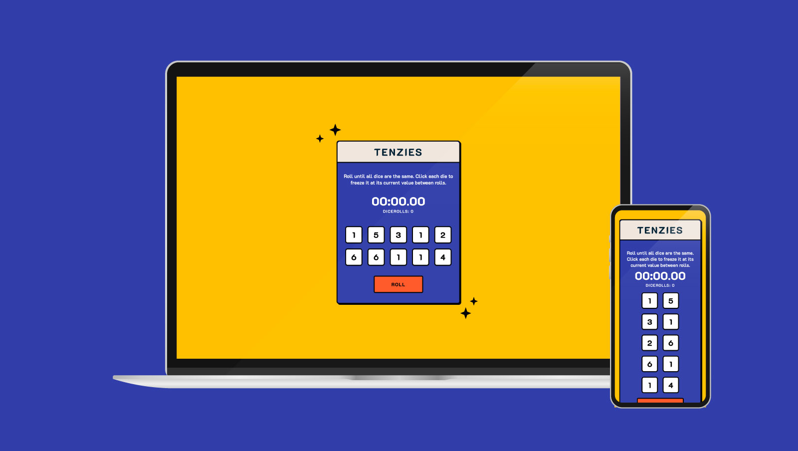

# Tenzies - The Ultimate Dice Rolling Game

## About this project

Tenzies is an exciting dice-rolling game that challenges players to roll a set of dice until they all show the same value. Players can click on individual dice to freeze them at their current value between rolls.

## Table of contents

- [Overview](#overview)
  - [Screenshots](#screenshots)
  - [How to play](#how-to-play)
  - [Features](#features)
  - [Built with](#built-with)
- [My process](#my-process)
  - [How did I build it](#how-did-i-build-it)
  - [What problem did I set out to fix](#what-problem-did-i-set-out-to-fix)
  - [What were some of the design decisions](#what-were-some-of-the-design-decisions)
  - [What I learned](#what-i-learned)
  - [What I would change if I had more time](#what-i-would-change-if-i-had-more-time)
- [Contributing](#contributing)
- [Author](#author)
- [Acknowledgments](#acknowledgments)

## Overview

**Live Demo**: [https://react-tenzies-dice-game.netlify.app/](https://react-tenzies-dice-game.netlify.app/)

### Screenshots

### How to Play

1. Click the "Roll" button to start the game.
2. The dice will roll, and their values will change.
3. Click on individual dice to hold them at their current value.
4. Click the "Roll" button again to roll the remaining dice.
5. Repeat until all dice show the same value.
6. Once all dice match, you've achieved "Tenzies"!

### Features

- Interactive dice rolling and holding mechanism.
- Timer to track the time spent on each game.
- "Tenzies" confetti celebration when you win!

### Built with
- Semantic HTML5 markup
- CSS for styling
- Flexbox
- CSS Grid
- [React](https://reactjs.org/) - JS library
- Nanoid: A tiny, secure, URL-friendly unique ID generator.

## My Process

To create Tenzies, I followed these steps:

1. **Design**: I started by conceptualizing the game's rules and user interface. I sketched wireframes and designed a minimalistic layout to keep the focus on the dice and game mechanics.
2. **Development**: I implemented the game using React components to manage dice state and interactions. The game logic checks for winning conditions and handles dice rolling and holding.
3. **Styling**: I utilized custom CSS to style the game elements, including the dice, buttons, and timer.

### What Problem Did I Set Out to Fix?

The goal of this project was to create an engaging and interactive dice-rolling game that allows players to test their luck and decision-making skills. I wanted to offer a simple yet enjoyable gaming experience that anyone can enjoy.

### What Were Some of the Design Decisions?

During development, I made the following design decisions:

- **Minimalistic Design**: The game's interface is kept simple, focusing on the dice and the core mechanics to ensure a straightforward and intuitive experience.
- **Responsive Layout**: The game is designed to be responsive and adaptable to different screen sizes, making it accessible to players on various devices.

### What I Learned

While creating Tenzies, I learned and improved in the following areas:

- **React State Management**: I deepened my understanding of managing state in React components and using `useState` and `useEffect` hooks to create dynamic behavior.
- **Game Logic**: I gained experience in implementing game logic, such as checking for winning conditions and handling user interactions in real-time.

### What I Would Change If I Had More Time

Given more time, I would enhance Tenzies by adding the following features:

- **Scoreboard**: Implement a scoreboard to keep track of players' best times and number of rolls to achieve "Tenzies."
- **Difficulty Levels**: Introduce difficulty levels with varying dice quantities or changing rolling patterns.
- **Sound Effects**: Include sound effects to enhance the gaming experience.

## Contributing

Contributions are welcome! If you have any suggestions, improvements, or ideas for collaboration, please feel free to reach out or submit a pull request.

## Author

- [Josh Merrill](https://www.josh-merrill.com)
- [Github](https://github.com/josh-merrill)
- [LinkedIn](https://www.linkedin.com/in/joshmmerrill/)
- [Email](mailto:joshmmerrill@outlook.com?subject=Hello!)

  
## Acknowledgments

I would like to extend my gratitude to all the dedicated instructors at [Scrimba](https://github.com/scrimba). Their valuable teachings and inspirational solutions have been a constant source of motivation, pushing me to improve and innovate in my web development endeavors.
